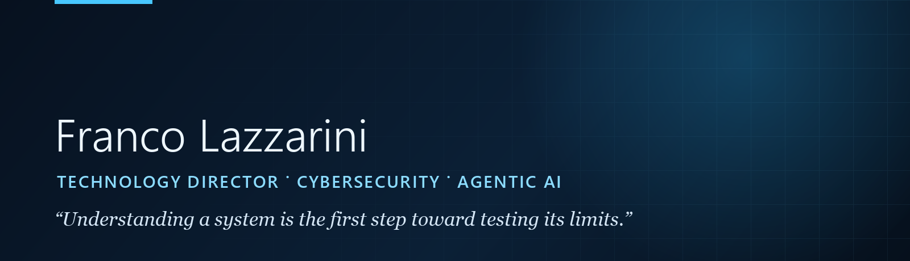

  

  
  
  
  

Technology leader with more than 20 years of international experience across Spain, Andorra, Ireland, and Mexico. I currently serve as Technology Director at JMA Integra, leading cybersecurity and AI initiatives from strategy and architecture through delivery, governance, and executive communication.

My background combines offensive security, systems and application assurance, infrastructure protection, risk governance, and enterprise AI. I focus on translating complex operational requirements into secure, traceable, and measurable technology programs.

### Areas of focus

- **Technology and cybersecurity leadership:** strategy, service design, delivery governance, team development, managed security, and executive decision support.
- **Offensive security and technical assurance:** Red Team operations, web and mobile application assessments, code review, infrastructure and Active Directory security, and remediation planning.
- **Agentic AI and enterprise automation:** tool-using agents, multi-agent orchestration, persistent memory, RAG and knowledge graphs, MCP and Microsoft 365 integration, scheduled operations, and human oversight.
- **Governance and secure architecture:** ISO/IEC 27001, ISO 31000, NIST, CIS, COBIT, least privilege, traceability, execution isolation, and data-residency controls.

### Professional trajectory

- **Technology Director — JMA Integra** | 2025–Present
- **Senior Offensive Cybersecurity Consultant — CommSec, Dublin** | 2024–2025
- **Principal Cybersecurity Specialist — Grupo Pyrenees, Andorra** | 2017–2023
- **Offensive Security Specialist — SIA Group / Indra, Madrid** | 2010–2016
- **Networks and Infrastructure — Verne Technology, Spain** | 2003–2009

### Credentials

- Offensive Security Certified Professional (OSCP)
- eLearnSecurity Mobile Application Penetration Tester (eMAPT)
- Burp Suite Certified Practitioner
- ISO/IEC 27001 Lead Auditor

### Languages

Spanish — Native · English — C1 · Catalan — B2 · Norwegian — B1

### Contact

Based in **Tijuana, Mexico**.

[www.francolazzarini.com](https://www.francolazzarini.com) · [info@francolazzarini.com](mailto:info@francolazzarini.com) · [LinkedIn](https://www.linkedin.com/in/fjldx)
